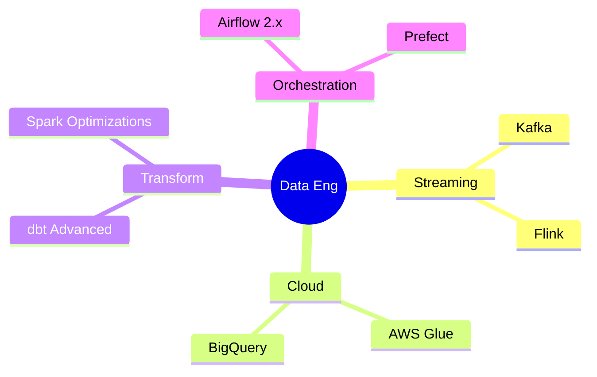

<div align="center">

<!-- Animated Banner -->


<!-- Typing animation -->
<a href="https://git.io/typing-svg">
  
</a>

</div>

---

## 🌟 About Me

```python
class DataEngineer:
    def __init__(self):
        self.name        = "Kechrida Mohamed Ali"
        self.role        = "Data Engineering Student"
        self.university  = "FSS"
        self.location    = "🌍 Tunisia"
        self.passion     = ["Big Data", "ETL Pipelines", "Cloud Architecture"]
        self.currently   = "Building scalable data pipelines 🔨"
        self.learning    = ["Apache", "dbt", "Snowflake"]
        self.fun_fact    = "I believe every byte of data has a story to tell 📖"

    def say_hi(self):
        print("Thanks for dropping by! Let's build something amazing together 🚀")

me = DataEngineer()
me.say_hi()
```

---

## 🛠️ Tech Stack & Tools

### 🐍 Languages


### ⚙️ Data Engineering


### ☁️ Cloud & Warehouse


### 🗄️ Databases


### 🐳 DevOps & Tools


---

## 📊 GitHub Stats

<div align="center">


</div>

---

## 🏗️ Data Pipeline Architecture (My Workflow)

```
  RAW DATA SOURCES                  PROCESSING                    SERVING
┌──────────────────┐         ┌────────────────────┐         ┌──────────────┐
│  🌐 APIs          │──────►  │  Apache Kafka       │──────►  │  Snowflake   │
│  🗃️  Databases    │         │  (Stream Ingestion) │         │  Data Warehouse│
│  📁 Files / S3   │──────►  │  Apache Spark       │──────►  │  dbt Models  │
│  🔄 CDC Streams  │         │  (Batch Processing) │         │  BI / ML     │
└──────────────────┘         └────────────────────┘         └──────────────┘
         │                            │                               │
         └──────── Orchestrated by Apache Airflow (DAGs) ────────────┘
                              Monitored & Deployed via Docker + AWS
```

---

## 🚀 Featured Projects

<div align="center">

[](https://github.com/medalikech/DataWarehouse_Project)
[](https://github.com/medalikech/WebSemantique_Project)

</div>

| 🔧 Project | 📝 Description | 🛠️ Stack |
|---|---|---|
| **Real-Time ETL Pipeline** | Streaming pipeline ingesting 1M+ events/day | Kafka, Spark, Airflow, AWS |
| **Data Warehouse Design** | Star schema DWH with dbt transformations | Snowflake, dbt, PostgreSQL |
| **Batch Pipeline Orchestration** | Automated DAGs for daily reporting | Airflow, Python, S3 |
| **Data Quality Framework** | Great Expectations + automated alerts | Python, GE, Slack API |

---

## 📈 Contribution Graph

<div align="center">
  
</div>

---

## 🏆 GitHub Trophies

<div align="center">
  
</div>

---

## 📚 Currently Learning



---

## 📬 Connect With Me

<div align="center">

[](https://linkedin.com/in/)
[](mailto:mohamesdali.kechrida120@gmail.com)
[](https://your-portfolio.com)

</div>

---

<div align="center">


*"Data is the new oil — and I'm the pipeline"* ⚡

</div>
